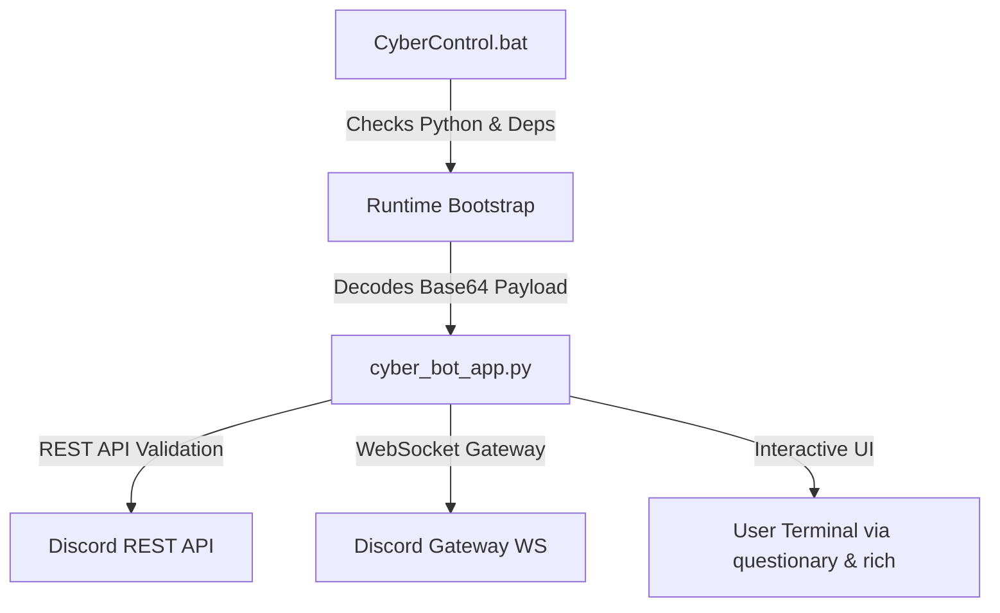

# ARCHITECTURE.md: CyberControl CLI

## 1. System Topology & Data Flow

## 2. Core Modules
- **`CyberBotApp` Controller:** Manages state, client threads, and event loops.
- **Async Thread Bridge (`run_coroutine`):** Safely executes Discord API coroutines from interactive menus without event loop conflicts.
- **Interactive CLI Menus:** Arrow-key navigation for streamlined operations.
